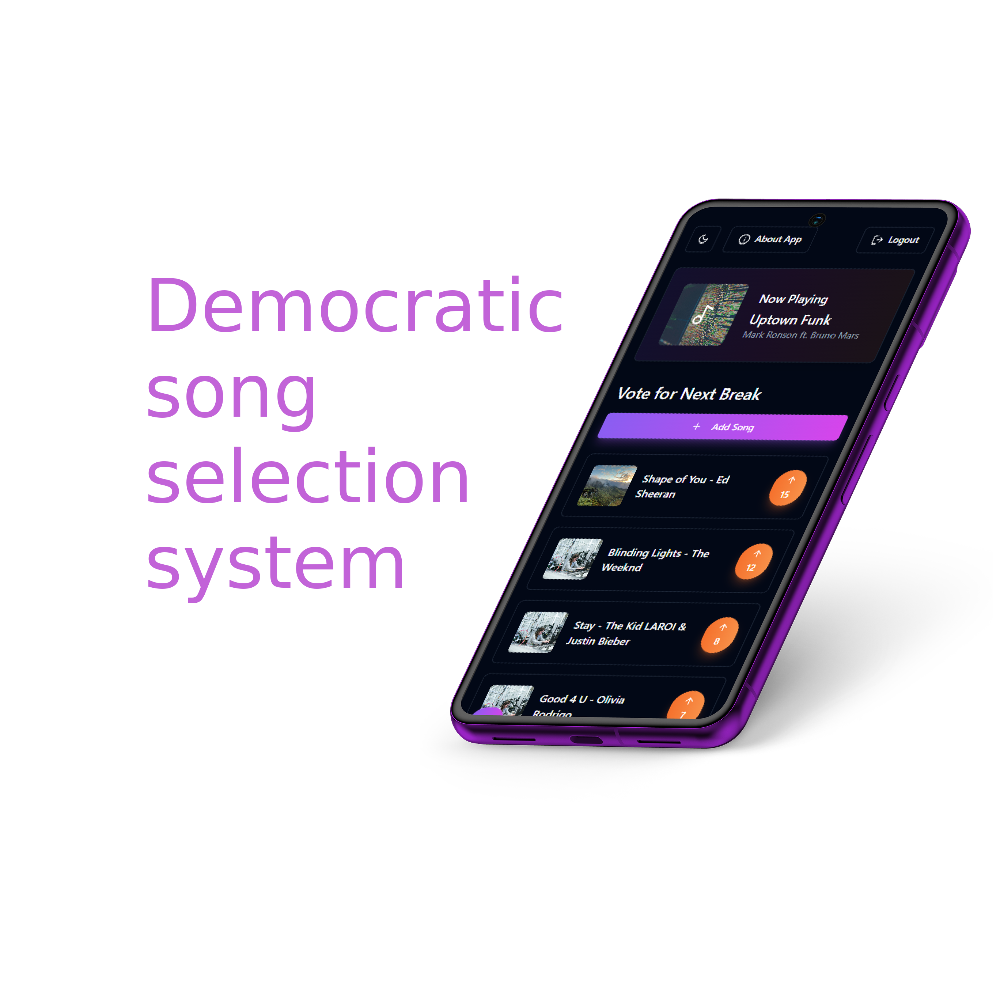

# 
# $${\color{#6625cb}RadiowezelZSZ: \space \color{#ea8ff6} For \space Students, \space \color{#ea8ff6}By \space Students}$$

Welcome to RadiowezelZSZ, where we're revolutionizing how music brings your school community together! We believe that great moments at school deserve a great soundtrack, and who better to create that soundtrack than the students themselves?

## 💫 Our Vision
Remember those moments between classes when the hallways come alive with energy? We wanted to make those moments even more special by letting students become their own DJs. RadiowezelZSZ isn't just another music app – it's a platform that gives students a voice in creating their school's atmosphere.

## ✨ Features That Make Us Unique

### 🎧 For Students, By Students
- Create your school's unique atmosphere through music
- Democratic song selection system
- Simple 4-digit authentication
- Real-time voting system

### 🛡️ Safe & Smart
- AI-powered content filtering
- School-appropriate music only

## 👋 Meet Our Team
We're a group of high school friends who bonded over our shared love for technology, music, and creating cool stuff! What started as casual discussions about our favorite songs during lunch breaks turned into a mission to make our school's atmosphere more vibrant. When we're not coding or designing, you can find us working on various other tech projects 🔧 , gaming together 🎮 or just enjoying ours lifes!

### Who We Are?
#### - *[Wojciech Błaszczyk](https://github.com/wblaszczyk06)* | 🏗️ Full Stack Developer & Database Specialist ⛁

#### - *[Damian Ciszak](https://github.com/Ciszpan3)* | 🎨 Frontend Developer

#### - *[Dawid Kaźmierczak](https://github.com/K4ziWolf)* | 🎯 UI/UX Designer

#### - *[Jakub Michalski](https://github.com/jakub1m)* | 🐍 Python & 🤖 AI Specialist

#### - *[Mateusz Snela](https://github.com/Over7oader)* | 🐍 Python & 🚀 Man on special assignment

## 🛠️ Technology Stack
### 🎨 Frontend
- 📱 React | Interactive UI
- 🎨 Figma | Design & Prototyping

### 🔧 Backend
- ⚡ .NET | Core Services
- 📦 MySQL | Data Storage
- 🐍 Python | Music Control & Data Processing

### 🔗 APIs & Services
- 🤖 Gemini API | AI-based content filtering
- 🎵 YouTube API | Music integration

### 🏗️ Development & Deployment
- 🐳 Docker | Simplified deployment & scalability

## 📬 Connect With Us
Have ideas? Questions? We'd love to hear from you!
- 📧 Email: radiowezel.zszgostyn@gmail.com
